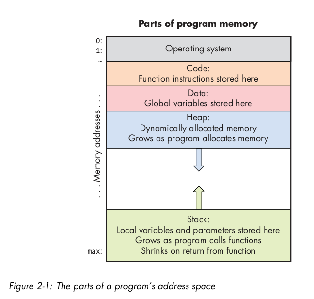

# ch:1 BASICS of C

## 1.1 C- compiling and running programs

- Python is interpreted => another program(the Python interpreter) runs Python programs: the Python inter­preter acts like a virtual machine on which Python programs are run.
- the program source code (hello.py) is given as input
  to the Python interpreter program that runs it.
- the Python interpreter is a binary executable that can be run directly on the underlying system(OS and hardware).
- gcc -o hello hello.c
- using Makefile is important
- On a 32/64-bit system, int is typically 32 bits(4bytes) in size, with a range of -2147483648(= -2^32) to 2147483647(= 2^32-1).
- You can print the exact size on a given machine using C’s sizeof operator.
- int-float arithmetic operation => results float

## 1.2 1.2 Input/Output (printf and scanf)

- The printf and scanf functions belong to C’s standard I/O library(#include <stdio.h>)
- %g specifier is particularly useful when you want to print floating-point numbers in a way that optimizes for readability by choosing the shortest representation
- Prefixing the name of a variable with the & operator produces the location of that variable in the program’s memory — the memory address of the variable.

## 1.3 conditionals and loops

- logical and (&&): stops evaluating at the first false expression (short­ circuiting);
- logical or (||): stops evaluating at the first true expression (short­ circuiting).
- In C, for loops and while loops are equivalent in power, meaning that any while loop can be expressed as a for loop, and vice versa. The same is not true in Python, where for loops are iterations over a sequence of values.
- for: use for definite loops(like iterating over a range of
  values), while: use for indefinite loops(like repeating until the user enters an even number).

## 1.4 functions

- Functions that don’t return a value should specify the **void** return type.
- Arguments to C functions are passed by value: each function parame­ter is assigned the value of the corresponding argument passed to it in the function call by the caller
- **Pass by value** semantics mean that any change to a parameter’s value in the function (that is, assigning a parameter a new valuein the function) is not visible to the caller.
- The **execution stack** keeps track of the state of active functions in a program. Each function call creates a new stack frame (sometimes called an **activation frame** or **activation record**) containing its parameter and local variable val­ues.
- **Prototypes** is a declaration of a function that specifies its name, return type, and the types and number of its parameters. It serves as a contract between the function definition and its callers, allowing the compiler to perform type checking and ensure that function calls are made with the correct arguments.
- The scope of a function prototype extends from its declaration to the end of the file. It can be declared at any point before it is used in the code. However, it is common practice to place all prototypes at the beginning of the program or in header files.

## 1.5 Statically declared => Arrays and Strings

- Accessing array beyond declaration(out of bound) can lead to unexpected program behavior, thus, as a C programmer, it’s up to you to ensure that your array accesses refer to valid positions!
- The capac­ity of the array parameter(in FUNCTION) arr isn’t specified: arr[] means that this function can be called with an array argument of any capacity.
- In C, the name of the array variable is equivalent to the base address of the array (i.e., the **memory address of its 0th element**). Due to C’s pass by value function call semantics, when you pass an array to a function, each ele­ment of the array is not individually passed to the function.
- the function isn’t receiving a copy of each array element. Instead, an array parameter gets the copy of the array’s base address. This behavior implies that when a function modifies the elements of an array that was passed as a pa­rameter, the changes will persist when the function returns. (SEE ./changing_arr.c)
- It is difficult to track string size, so strings in C must end with a special character value, **the null character ('\0')**, to indicate the end of the string.
- When we scanf string , we dont use address(&) => char name[20]; scanf("%[^\n]",name); because name is base address as explained above.

## 1.6 Structs

- Collection of data elements of different types.

- When we assign one struct var with another, it copies values not references.

- C provides a sizeof operator that takes a type and returns the number of bytes used by the type.

- single variables of base types, array-elements, and structs are all **lvalues** i.e, they can appear on the left side of an assignment statement.

- passing a struct as an argument to a function gives the parameter a copy of all the argument struct’s field values.

- If the function changes the field values of a struct parameter, the changes to the parameter’s field val­ues have no effect on the corresponding field values of the argument. That is, changes to the **parameter’s fields** only modify values in the parameter’s memory locations for those fields, not in the **argument’s memory locations** for those fields.

# ch2: C- deep dive

## 2.1 Parts of Program memory and space

- Global variables are declared outside function bodies.(GENERAL ADVICE: avoid programming with global variables whenever possible.)
- Local variables and parameters are only in scope inside the function in which they are defined.
- A function’s parameters and local variables are only al­located in program memory when the function is active.
- **Address Space** - **Memory**(basically storage-locations it needs for execution of prog. **or** array of addressable bytes) allocated by OS upon launching a new program.
- .

## 2.2 C Pointer's Variable

- Pointer uses:

  - implement functions whose parameters can modify values in the caller’s stack frame
  - dynamically allocate (and deallocate) program memory at runtime when the program needs it
  - efficiently pass large data structures to functions
  - create linked dynamic data structures(eg,linked lists)
  - interpret bytes of program memory in different ways.

- Memory (address(0X23232c) and value(integer 42)).
- Pointer is just a value/data-type that happens to be an address and has 3 basic syntaxes:

  - 1.> int x = 4; => "integer named x is set to 4"
  - 2.> int \* ptr_X = &x; => "integer-pointer named ptr_X is set to address of x" (called referencing)
  - 3.> int y = \*ptr_X; => "integer named y is set to value where ptr_X is pointing to." (called de-referencing)

- (star)\* after datatype(eg: int \*) defines a pointer and (star)\* before a variable(which is pointer)(eg: int \*) de-refernces it gives the value.
- Pointer variable after defining is written by name when assigning a value and with Star+name when dereferencing the value.

- All pointer variables can also be assigned a special value, NULL, which represents an invalid address. While a null pointer (one whose value is NULL) should never be used to access memory, the value NULL is useful for testing apointer variable to see if it points to a valid memory address.

- ptr1 = ptr2; => ptr1 gets the address value stored in ptr2, i.e ptr1 starts pointing to where (ptr2 is pointing)

## 2.3 Pointers & Functions

- pass by pointer pattern uses a **pointer function parameter** that gets the value of the address of some storage location passed to it by the caller
- in C pass by value is default.

## 2.4 Dynamic Memory Allocation

- Heap memory(binary tree - for every node, the value of its children is greater than or equal to its own value)
- Heap memory region is used for DMA.
- a ptr variable in stack stores the address of dynamically allocated heap memory (it points to heap memory).

- Heap meamory is anonymous i.e, addresses in the heap are not bound to vari­able names.
- Declaring a named program variable allocates it on the **stack** or in the **data** part of program memory. A local or global pointer variable can store the address of an anonymous heap memory location (e.g., a local pointer variable on the stack can point to heap memory), and dereferencing such a pointer enables a program to store data in the heap.

- **malloc(size_t noOfBytes)** => allocates & **free(address/ptr)** => deallocates memory in the heap.
- malloc returns a address to the allocated memory i.e, void \* type, which represents a generic pointer to a non­specified type
- p = (int \*) malloc(sizeof(int)); => idomatic => it recasts the return type of malloc to an int \*
- always test malloc's its return value for NULL: indicating malloc() call failure, iprog. fails do => exit(1);
- It’s also a good idea to set the pointer’s value to NULL af­ter calling free.

- C programs store the pointer to heap locations on the stack. The pointer variables contain only the base address(the starting ad­dress) of the array.

- After a program has made some calls to malloc and free, heap memory can become **fragmented**, meaning that there are chunks of free heap space interspersed with chunks of allocated heap space. The heap memory manager typically keeps lists of different ranges of sizes of heap space to enable fast searching for a free extent of a particular size.

- The free function may seem odd in that it only expects to receive the address of the heap space to free without needing the size of the heap space to free at that address. That’s because malloc not only allocates the requested memory bytes, but it also allocates a few additional bytes right before the allocated chunk to store a header structure.
- The header stores metadata about the allocated chunk of heap space, such as the size. As a result, a call to free only needs to pass the address of heap memory to free. The implementation of free can get the size of the memory to free from the header information that is in memory right before the address passed to free.

- The parameter declarations int \*arr and int arr[] are equivalent whether you pass statically or dynamically allocated array.
- Statically declared arrays are allocated either on the stack (for local vari­ables) or in the data region of memory (for global variables).
- Contiguous memory addresses:The location of element i is at an offset(4 byte for int and 1 byte for char) i from the base address of the array. The exact address of the ith element depends on the number of bytes of the type stored in the array.

- A segmentation fault (often referred to as a segfault) occurs when a program attempts to access a memory location that it is not allowed to access. eg: Dereferencing NULL Pointers, Accessing Out-of-Bounds Array Elements, writing to read-only memory, etc.

## 2.5 Arrays in C

- **offset calculation:** address = base\*address + (i \* number\*of_columns + j) \* size_of_element
- For multidimensional array parameters, you must indicate that the pa­rameter is a multidimensional array, but you can leave the size of the first dimension unspecified (for good generic design). The sizes of other dimen­sions must be fully specified so that the compiler can generate the correct offsets into the array.
- a C constant definition: COLS is defined to be the value 100 => #define COLS (100). define is preprocesssed i.e value(of COLS) will is replaced(in all COLS appearences) before compilation.

- 2 methods to dynamically allocate a matrix:
  1. **Memory efficient allocation:** Make a single call to malloc, allocating one large chunk of heap space to store all N × M array elements. double indexing arr[2][3] can't be used as compiler does not know know the difference between a 2D or 1D array allocation using this method.
  2. **Dev-friendly:** the element locations within a row are contiguous, but elements are not contiguous across rows of the 2D array. programmer can use double-indexing.
- Size of int\*: 8 bytes(in 64 bit systems) and 4 bytes in(32-bit systems).
- read book page 90-93.

## 2.6 String and String library

- there is no difference bw strings and arrays allocation. strings are just arrays with char type terminated by a special null character value '\0'.
- as a programmer, you must ensure that sufficient memory is available at the destination prior to calling funcs like(strcpy,strcat).
- If a function returns a string (its return type is a char \*), its return value can only be assigned to a variable whose type is also char \*; it cannot be assigned to a statically allocated array variable. This restriction exists because the name of a statically declared array variable is not a valid lvalue (coz its base address in memory cannot be changed).

- read 96-105 for string library functions.
- sprintf prints into a string.
- atoi and atof.

## 2.7 C Structs

- struct studentT \*sptr;
- sptr = malloc(sizeof(struct studentT));

- Note that the call to malloc initializes sptr to point to a dynamically allo­cated struct in heap memory. Using the sizeof operator to compute malloc’s size request (e.g., sizeof(struct studentT)) ensures that malloc allocates space for all of the field values in the struct.

- to accses individual fields use de-referencing:
  (\*sptr).grad_yr = 2021;
- C provides a special operator (->) that both dereferences a struct pointer and accesses one of its field values .

- . dot for struct in stack and -> for struct in heap.

### array of structs

- struct studentT classroom_1[40];// an array of 40 struct studentT
- struct studentT \*classroom_2;// a pointer to a struct studentT // (for a dynamically allocated array)
- struct studentT \*classroom_3[40]; // an array of 40 struct studentT \* **not an array of struct studentT.(like 1 & 2)** // (each element stores a (struct studentT \*)

### self referential structs

- A struct can be defined with fields whose type is a pointer to the same struct type.
- used to build linked lists, trees and graphs.

## 2.8 I/O in C (stdio.h)

- In Unix-like operating systems, **stdin, stdout, and stderr** are 3 standard data streams used for input and output operations.

- A program can write (print) output to stdout and stderr, and it can read input values fromstdin. stdin is usually defined to read in input from the keyboard, whereas stdout and stderr output to the terminal.

- redirect a.out's stdin to read from file infile.txt:=> $ ./a.out < infile.txt
- - redirect a.out's stdout to print to file outfile.txt:=> $ ./a.out > outfile.txt
- redirect a.out's stdout and stderr to a file outfile.txt:=> $ ./a.out < outfile.txt
- redirect all three to different files:
  (< redirects stdin, 1> stdout, and 2> stderr):
  $ ./a.out < infile.txt 1> outfile.txt 2> errorfile.txt

- getchar and putchar respectively read or write a single char­acter value from stdin and to stdout. getchar is particularly useful in C pro­grams that need to support careful error detection and handling of badly formed user input (scanf is not robust in this way).

- ch = getchar(); // read in the next char value from stdin
  putchar(ch);
  // write the value of ch to stdout

- The C standard I/O library (stdio.h) includes a stream interface for file I/O. A file stores **persistent data**: data that lives beyond the execution of the pro­gram that created it.
- When opening a file, the current position starts at the very first character in the file, and it moves as a result of every character read (or written) to the file. To read the 10th character in a file, the first nine characters need to first be read

- Step1: a pointer to FILE type is used to read/write files.
- Step2: use fopen() to derefrence FILE ptr
- Step3: use I/O operations to read, write, or move the current position in the file
- Step4: fclose()

- rewind(FILE \*f) =? resets current position to beginning of file
- fseek(FILE \*f, long offset, int whence) => to move to a specific location in the file:

## 2.9 Advanced features

- **command line arguments**
  use main(main(int argc, char \*argv[]))
- **The void \* Type and Type Recasting**
  int a = 10;
  int *p = &a; // Pointer to int
  void *vp = (void *)p; // Cast int pointer to void pointer
  int *p2 = (int \*)vp; // Cast back to int pointer
- **pointer arithmetic** : increment/decrement, add/sub, access contiguous memory
- **Libraries: Using, Compiling, and Linking** :
  - C library consiss of 2 parts : **API**(API to the library gets defined in header(.h) files.) and **Implementaion** of the library's functionality often made available to programs in a precompiled binary format that gets linked(added) into the binary executable created by gcc.
  - eg: for strings: API is <string.h> and implementation of the C string library is part of the larger standard C li­ brary (libc) that the gcc compiler automatically links into every executable file it creates.
  - These binary for­mats are not executable independently but they provide executable code that can be linked into (added into) an exe­cutable file by gcc at compilation time.

### 2.9.7 compiling C to assembly and compiling and linking assembly and C code

- $ gcc -m32 -S simpleops.c
  => runs the assembler to create a .s text file. This command creates a file named simpleops.s with the compiler’s IA32 assembly translation of the C code.IA32 is nothing but assembly language.
- $ gcc -m32 -c simpleops.s
  => compiles to a relocatable object binary file (.o)
- $ gcc -m32 -o simpleops simpleops.o
  => creates a 32-bit executable file.This command creates a binary executable file, simpleops, for IA32 (and x86_­64) architectures.
- objdump displays the machine code and assembly code mappings in .o files: $ objdump -d simpleops.o

- Unlike C, which is a high-level language that can be compiled and run on a wide variety of systems, assembly code is very low level and specific to a particular hardware architecture.

# ch3: C- debugging

## gdb(gnu debugger)

- useful for examining a program’s runtime state.
- programmer can see data and stack memory.
- when compiling for debugging, avoid compiler optimizations like building with -o
- compile with -g option adds extra debugging information to executable bin file.

- Sometimes, when a program terminates with an error, the operating system dumps a core file containing information about the state of the pro­gram when it crashed. The contents of this core file can be examined in GDB by running GDB with the core file and the executable that generated it:
  $ gdb core a.out
  (gdb) where # the where command shows point of crash

- **gdb commands**: break lineNum/func_name, run, cont, quit, next, step, list, print var_name, where, frame
- **display**- displays the variable values at every breakpoint automatically.
- **frame** has levels - move to context of any frame on the stack.(0 is top frame)
- no need to type next, use enter only.
- where command is helpful for pinpointing the location of a program crash and for examining state at the interface between function calls and returns.
- **x (examine memory)**: Display the contents of a memory location.
- **make** command to rebuild an executable during a debug­ging session, and if the build is successful it will run the newly built program (when issued the run command).

## Valgrind(memcheck tool)

- Analyzes a pro­gram’s memory accesses to detect invalid memory us­age, uninitialized memory usage, and memory leaks.
- since heap memory is allocated/deallocated during runtime, the above errors(memory errors) are not noticed at compilation.
- errors:

  1. Reading (getting) a value from uninitialized memory.(malloced but not given value)
  2. writing to unallocated memory(unmalloced)
  3. reading from unallocated memory(unmalloced)
  4. Freeing already freed memory.
  5. Memory leaks - A memory leak is a chunk of allocated heap memory space that is not referred to by any pointer variable in the program, and thus it cannot be freed.
  6. Segmentation fault - occurs when a program attempts to access a memory location that it is not allowed to access.
     eg: see ./03_big_fish.c => sometimes one ptr1 can write to ptr2 's address or even its metadata headers and when we free ptr1, ptr2's free() call crashes.

- valgrind can only find heap memory faults, stack and data memory errors is not detected.

- $ valgrind --leak-check=yes ./a.out => To view details of individual memory leaks.

- Each line of Valgrind output is prefixed with the process’s ID (PID) eg: ==30159==

- Apart from memcheck, Valgrind also has other tools massif(heap profiler to analyze memory usage over time), cachegrind( cache profiler that simulates how your program interacts with CPU caches.), helgrind(detect thread errors).

### left/ todo: 3.5 Advance GDB features, 3.6 debugging assembly code, 3.7 debugging multithreaded programms with GDB
