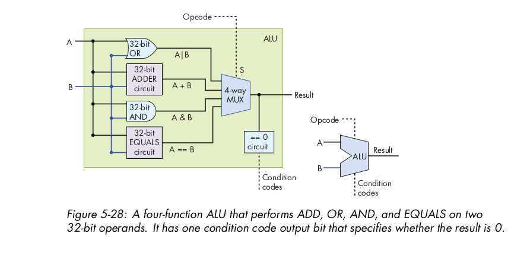
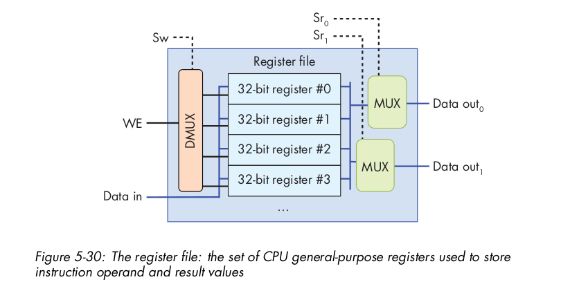

# ch5: WHAT VON NEUMANN KNEW: COMPUTER ARCHITECTURE

## introduction

- **Processor** (more generic term) refers to any component of computer which processes data like GPU, CPU, DSP's, etc.
- **CPU** executes **program instruction** on **program data** both of which are stored in **RAM**.

- **ISA(Instruction Set Architecture)** specifies the set of instructions/operations and their binary en­coding, the set of CPU registers, and the effects of executing instructions on the state of the processor.
- There are many different ISAs, including SPARC,IA32,ARM, X86.
- **Michroarchitecture** is the circuit-design of specific ISA implementation.eg: AMD and intel produce different microprocessor implementations of IA32 ISA.
- Some ISAs define a reduced instruction set computer (RISC), and others define a complex instruction set computer (CISC).

- RISC:

  - small set of basic/simple fixed-sized instructions and addressing modes.compilers combine sequences of several basic RISC instructions to implement higher­level functionality.
  - requires high RAM due to more no. of instructions.
  - Executes one instruction per clock cycle, hence **time efficient**
  - SPARC for high-end cloud servers and ARM for mobile devices.
  - Low power consupmtion.

- CISC:

  - large no of complex variable-sized instructions and addressing modes.It provides high-level functionality in one instruction.
  - requires less RAM due to less no. of instructions, hence **memory efficient**
  - takes multiple clock cycles to execute one instruction.
  - Intel’s x86 ISAs are CISC-based used in desktops/servers.
  - High power consupmtion.

- All modern processors follows von-neumann architecture which uses a **stored-program model(SPM)** which means that program instructions and program data both reside in computer memory and both are inputs to the processor.

## 5.2 Von-Neumann Architecture

- .

- consists of 5 components: (CPU = PU + CU)

  - **Processing unit** executes program instructions has **ALU**(for performing math operations add,sub,logical,etc) and **registers**(small&fast unit of storage used to hold program data and the instructions that are being exe­cuted by the ALU.)
  - **Control unit** drives program instruction execution on the pro­cessing unit by loading them from memory and feeding instruction operands and operations through the processing unit.It has **program counter**(keeps the memory address of the next instruction to execute,) and **IR:Instruction Register**(to store instruction loaded from memory, that is currently being executed)

  - **Memory unit/RAM** stores program data and instructions
  - **input unit(s)** load program data and instructions on the com­puter and initiate program execution, eg: keyboard,mouse,camera,microphone.
  - **output unit(s)** store or receive program results usually monitor and speakers.

- CPU also has a clock that drives the circuitry of the CPU to execute program instructions.

- Buses are communication channel that connect the units, and are used by the units to send control and data(binary) to one another.
- 3 types: address bus(sends memory address of a read/write request to the memory unit,), control bus(control signals decide who plays sender/receiver), data bus(64/32 parallel wires that together transfer a 4­/8 bytes of value).

- There is no distinction between instructions and data in the von Neumann architecture. For all intents and purposes, instruc­tions are also data. Each **register** is therefore capable of holding one data word.
- In modern systems, the smallest addressable memory unit is one byte (8 bits), and thus each address corresponds to a unique memory location for one byte of storage. As a result, 32­bit architectures typically support a maximum address space size of 2^32 , which corresponds to 4 gigabytes (GiB) of **addressable memory or RAM**.
- Think of **RAM** as a linear array of addresses, where each address corresponds to one byte of memory.
- Word size, which is defined by an ISA, is the number of bits of the standard data size that a processor handles as a single unit.

- Like touchscreen Solid­state and hard drives are another example of devices that act as both input and output devices. These storage devices act as input devices when they store program executable files that the operating system loads into computer memory to run, and they act as output devices when they store files to which program results are written.

### von Neumann Machine in Action: Executing a Program

- .

- CPU,ram and i/o devices implement **fetch–decode–execute–store (sometimes called load(fet,dec,exec)-and-store)** cycle of actions that together execute program instructions.

1. CU(contol unit) fetches the next instruction from memory unit and CU's PC places next instuction's address on the address bus with a read command on the con­trol bus to the memory unit.
   - The instruction register (IR) stores instuction-data(in bytes) received from the memory unit. The control unit also increments the PC’s value to store the address of the new next in­struction to fetch.
2. CU decodes the instruction(which operation to perform and where are operands located) stored in IR.
   - The control unit also fetches the data operand values from their locations (from CPU registers, memory, or encoded in the instruction bits), as input to the processing unit.
3. The processing unit executes the instruction. The ALU performs the instruction-operation on instruction-data-operands.
4. Control unit stores processing unit's result to memory/RAM by placing the result value on the data bus, placing the address of the storage location on the address bus, and placing a write command on the control bus. When received, the memory unit writes the value to memory at the speci­fied address.

## 5.3 Logic Gates

- Logic gates are the building blocks of the digital circuitry that implements arithmetic, control, and storage functionality in a digital computer.

- Logic Gates are implemented by arrangement of few **transistors**(switches) that are etched into semiconductor silicon chips.
- The number of transistors that can fit on an integrated circuit (a chip) is a rough measure of its power(in watts).

- Basic Logic gates - AND, OR, NOT and others: NAND, NOR, XOR
- Today’s integrated circuits chips are built using CMOS technology, which uses NAND as the basic building block of circuits on the chip.

## 5.4 Integrated Circuits

- Combinations of logic gates forms a circuit and Simple circuits are combined together to create new complex circuits and these immense no. of abstractions helps to build complete process­ing, storage, and control components of a processor.
- 3 main categories of circuit building blocks: arithmetic/ logic, control, and storage circuits.

### a) Arithmetic and Logic circuits

- used to execute math instructions of an ISA, eg: whole of CPU's ALU, CU's PC incrementing,etc
- to design a circuit, 1st design a 1-bit circut and then use that to implementing M­bit versions of the circuit.
- 3 steps to design 1-bit circuit:
  1. design truth table by specifing no of i/ps and the final o/p
  2. write expression in terms of lofgic gates(AND,OR,NOT)
  3. Translate the expression into a sequence of logic gateswhere each gate gets its inputs from either an input to the circuit or from the output of a preceding logic gate.
- Course DIgital Electronics: (SE ENTC) is about these only
- adder, mux,demux, etc.

### b) control circuits

- used throughout the systems, On the processor, they drive the execution of program instructions on program data. They also control loading and storing values to different levels of storage (between registers, cache, and RAM), and control hardware devices in the system.
- A multiplexer (MUX) is an example of a control circuit that selects, or chooses, one of several values. The CPU may use a multiplexer circuit to select from which CPU register to read an instruction operand value.
- A demultiplexer (DMUX) is the inverse of a multiplexer. It takes a single input value and a selection input, and has N outputs.

### c) storage circuits(SRAM)

- used to construct computer memory for storing binary values.
- SRAM:
  - does not need to have its values refreshed, hence called static
  - built from storage-circuits
  - uses: CPU registers, on-chip cache memory.
- DRAM:

  - requires periodic refresh of values hence dynamic
  - built from capacitors
  - uses: RAM

- To store a value, a circuit must contain a feedback loop(to retain the value), ie When the circuit stores a value, its currently stored value and its inputs together produce an output that matches the currently stored value
- When a new value is written, the inputs temporarily change to update the stored value, after which the circuit stabilizes to maintain this new value until it is changed again.

#### RS latch

- A latch is a digital circuit that stores (or remembers) a one­bit value.
- .

- RS latch: 2-i/ps R,S and 1-o/p Q
- RS latch is the feedback loop from its outputs to its inputs: the output of the top NAND gate (Q) is input (a) to the bottom NAND gate, and the output of the bottom NAND gate (~Q) is input (b) to the top.
- When R,S both =1 => latch stores Q.
- To change the value stored in an RS latch, the value of exactly one of R or S is set to 0. When the latch stores the new value, R and S are set back to 1.

- .
- .

- A gated D latch adds circuitry to an RS latch to ensure that it never receives an input of 0 to both R and S simultaneously.

- CPU register has two input values: a 32­bit data value and a one­bit Write Enable(WE) signal.
- 

## 5.5 Building a processor: main CPU parts combined(in detail)

### ALU

- Below is implementation of:
  if( (x + 8) != 0 ) {
  x++;
  }
- 
- opcode input to the ALU is used as the signal input to the multiplexer to select which arith­metic/logic operation to select as the ALU’s output.
- 

### register file

- At the top of the memory hierarchy, the CPU’s set of general­purpose regis­ters(generally 8 to 32) store temporary values.
- Instructions often get their operand values from, or store their results to, general-­purpose registers. eg: “add the value from Register 1 to the value from Register 2 and store the result in Register 3.”

- A register file ckt with 4 32-bit registers.
- 
- Each read selection inputs (Sr0 and Sr1 ) is fed into one of the MUXs to pick the register value for the corresponding output.
- When the WE bit is 1, the DMUX outputs a WE bit value of 1 to only the register specified by the write selec­tion input (Sw ), resulting in the Data in value being written to the selected register only.

- Prog.Counter(PC stores mem. addr of next instruction) and IR(instruction register stores bits of current instruction) are special-purpose registers.

### low-level CPU design

## 5.6 The Processor’s Execution of Program Instructions(using clock)

- Addition example using 4 stages: fetch-decode-execute-store
  
  
  
  
  

### clock-driven execution

- CPU clock determines when inputs to circuits associated with each stage are ready to be used by the cir­cuit, and it controls when outputs from circuits represent valid results from one stage and can be used as inputs to other circuits executing the next stage.
- Clock measures discrete time(discrete click/ticks) as opp. to continuous. 1Ghz(freq) = 1/(clock-cycle time in sec =1billion ticks)
- higher clock freq => more CPU speed as 3 GHz processor achieves 3 billion instructions per second
- early 2000's Clock rates peaked with 4.4GHz, but then came multicore processors which improved CPU performance.

- **Clock Cycle** has 4 states:

  - new i/p: input values are ready for a stage.
  - While the clock’s value is 1, these inputs propagate through the circuit until the output of the circuit is ready.
  - o/p ready: Output propagates to register file i/p. clock's value turns 0.
  - write stage
    

- 1 instruction has 4 stages:fetch-decode-exec-write
- 1Ghz processor completes 10^9 stages in one sec.
- 1Ghz processor completes 10^9/4 instructions(which is 2.5\* 10^8) in one sec.
- 1 instruction takes 4 nanoseconds to complete with a 1Ghz processor.
  

## 5.7 Pipelining: Making CPU faster

- Executing say 3 instructions(FDEW) takes 12 clock cycles, resulting in CPI(cycles per instruction)= 4.
- Problem: after the Fetch stage, the fetch circuitry in the CPU is not used to per­form any useful action related to executing an instruction for the next three clock cycles.
- Solution: **CPU pipelining** => **ILP**:Instruction-level parallelism within a single processor by allowing the execution of a se­quence of instructions to overlap.
  
- after 4th cycle CPI becomes 1 coz every cycle will finish writing

## 5.8 Advanced Pipelined instruction consideration

- Consider following Assembly code:
  1. MOV M\[0x84], Reg1 # move value at memory address 0x84 to register Reg1
  2. ADD 2, Reg1, Reg1# add 2 to value in Reg1 and store result in Reg1
  3. MOV 4, Reg2# copy the value 4 to register Reg2
  4. ADD Reg2, Reg2, Reg2 # compute Reg2 + Reg2, store result in Reg2
  5. JMP L1<0x14># jump to executing code at L1 (code address 0x14)
- Not all instructions take same 4 stages for execution:
  - 1st MOV instruction requires five stages(f-d-e-**memory(read/write from/to memory)**-read), as it requires the movement of data from memory to a register.
  - Next 3 statements require 4 standard 4stages(fdew).
  - last JMP statement does not update a general­purpose register,resulting in only three stages (F, D, E).
- A pipeline stall results when any instruction is forced to wait for another to finish executing before it can continue. Compilers and processors do whatever they can to avoid pipeline stalls in order to maximize performance.

- Data hazards occurs when two instructions attempt to access common data in an instruction pipeline.
- Control hazards, also known as branch hazards, occur in pipelined CPU architectures when the flow of instruction execution is disrupted due to branch instructions

- A thread is an independent stream of execution.
- ILP(instruction level parallelism): ability of a processor to execute multiple instructions simultaneously within a single thread of execution.
- Multicore Processors: multiple processing units (cores) on a single chip, each capable of executing its own thread of instructions. This architecture leverages Thread-Level Parallelism (TLP), where different cores execute different threads simultaneously.
- Hardware multithreading:allows a single core to manage multiple threads simultaneously. This is typically achieved through techniques like simultaneous multithreading (SMT), where the core can switch between threads rapidly to maximize resource utilization.
