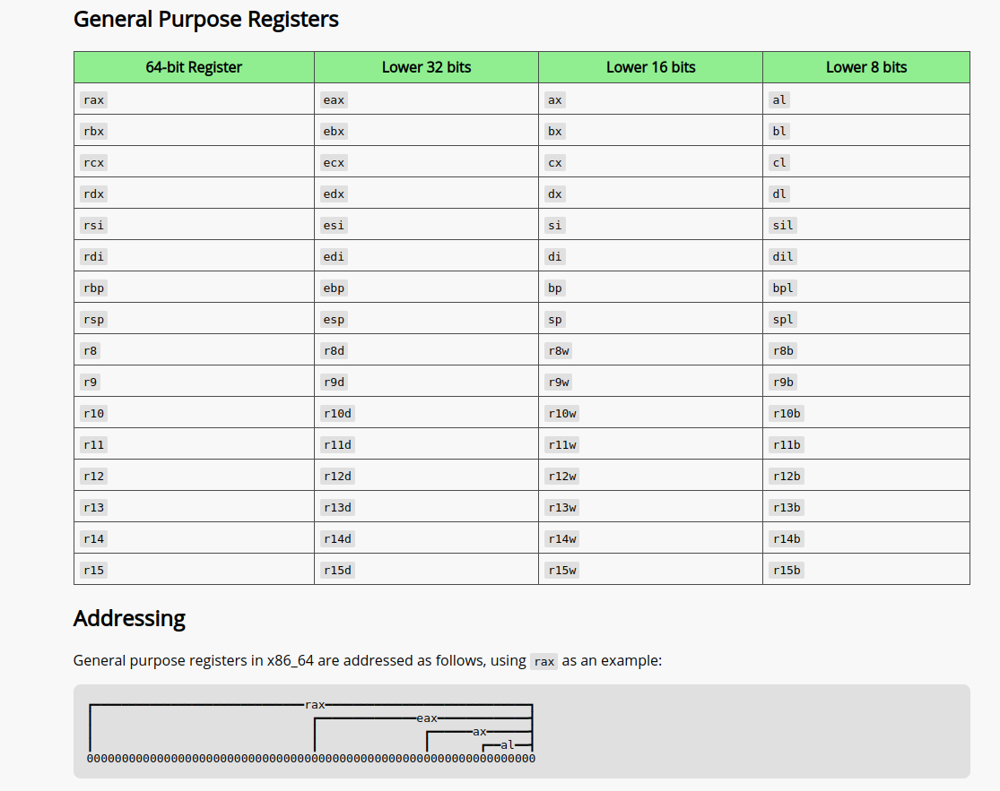

# Ch-6: Under the C: Diving into Assembly Language

- Before the invention of compilers, Assembly lang was the closest a programmer gets to coding at the ma­chine level without writing code directly in 1s and 0s.

- Compiler translates human-readable syntax into machine code(0's and 1's) using :

  - PL rules.
  - OS specifications.
  - ISA of the machine.

- Why should we learn assembly?
  1. Higher-Level Abstraction Hides Valuable Program Details.
  2. Computers(like washing machine,coffee machine, embedded systems) are too resource constrained for compilers(due to small processors) and hence cannot execute compiled code written by high level langs, thus programmed by assembly.
  3. For Finding Vulnerabilities in systems, and reverse engineering malicious code.
  4. There are some components of a computer system that just cannot be optimized sufficiently by compilers and require handwritten assembly.

# Ch-7,8,9: 64-BIT X86 ASSEMBLY (X86-64)

## introduction

- S86_64:X86 is synonymous with IA-32 with 64-bit extension.
- 2 common assembly syntaxes: at&t(here used) and intel.

- **objdump -d bin_c_file** > output => used to disassemble the contents of the specified sections of an object file or executable into human readable format.
- **less** output => to see file content, use "/adder2" to search for "adder2" occurence in the file.

- Each line contains an instruction’s 64­bit ad­dress in program memory, the bytes corresponding to the instruction, and the plaintext representation of the instruction itself.
- eg: **000000000040052c** <adder2>: 64-bit address followed by function name.
  below that: **40052c** : 55 push %rbp
  => 55 is the machine code representation(this is gen. in hex) of the instruction push %rbp.
  => this push instruction occurs at address **0x40052c**. this address is 64-bit, preceding 0's are removed for readability.

- Registers(word-size storage(64-bit/8bytes in our system)): Intel CPU has 16 data-registers:

  - %rax, %rbx, %rcx, %rdx, %rdi, %rsi, %rsp, %rbp, %r8, %r9, %r10, %r11, %r12, %r13, %r14, %r15
  - %rsp(stack pointer), %rbp(frame/base pointer)- for operations that maintain the layout of the program stack. %rsp points top, %rbp points base of the stack.
  - %rip(not a data-register) or the instruction pointer, some­times called the program counter (PC). It points to the next instruction to be executed by the CPU in **the memory unit or RAM**. Unlike the 16 registers mentioned previously, pro­grams cannot write directly to register %rip.

- Accessing the lower bits of registers is straightforward and allows for efficient manipulation of data. To access
  
- The higher and lower bytes within the lower 16 bits of the first four listed registers can be accessed by taking the last two letters of the register name and replacing the last let­ter with either an h (for higher) or an l (for lower) depending on which byte is desired.eg: %al references the lower eight bits of register %ax, whereas %ah references the higher eight bits of register %ax.

- Compiler chooses:

  - 64-bit registers when dealing with 64-bit data(eg: long, pointers)
  - 32-bit regs with ints,etc
  - that is why, in adder2() example we see %eax instead of %rax. if we had long type we wud hav seen %rax.

- Instruction Structure => opcode(operation code, eg: add,mul,mov) + operands in (source_register, destination_register), eg: add $0x2,%eax
- There are 3 operand possible: constants($), registers(%), and memory-address(any value enclosed in brackets() or other than % and dollar ) and all these operands holds binary/hex values which they hold.
  - values preceded by "$" => constants
  - **mov %rsp,%rbp** => copy value from source register (%rsp) the destination (register %rbp).
  - **memory forms**: combination of registers and constant values. eg: mov -0x4(%rbp),%eax, => accesses the memory location that is 4 bytes below the address stored in %rbp. (i.e., subtract 0x4 from %rbp), and then perform a memory lookup.” Same as **pointer dereferencing.** since %rbp is base pointer.

the notation M[x] in this context denotes the value at the memory location specified by ad­dress x.

## common instructions(S-source, D-destination)

- **mov S,D** => S→D =>(copies value of S into D)
  **add S,D** => S+D→D => (adds S to D and stores result in D)
  **sub S,D** => D–S→D => (subtracts S from D and stores result in D)
- eg: mov -0x4(%rbp), %eax
  add $0x2, %eax
  - copy value located at M[%rbp – 0x4] to register %eax
  - add value 0x2 to register %eax, and store the result in register %eax.
- On x86­64 systems, the execution stack grows toward lower addresses unlike C which grows towards higher addresses (towards heap), imagine assembly stack face downwards.

- push and pop simplifies call stack management.
  1. **push S** Pushes a copy of S onto the top of the stack. Equivalent to:
     sub $0x8,%rsp
     mov S,(%rsp)
  2. **pop D** pops the top element off the stack and places it in location D.Equivalent to:
     mov (%rsp), D
     add $0x8,%rsp
- call stack is in memory unit/ RAM
  
  
  
  
  
  
  
